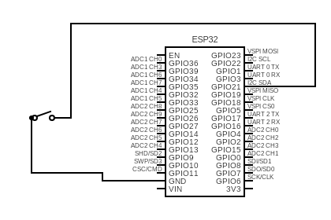

# VictronSmartCharge-KeySwitch 🔌🔑

## Description
VictronSmartCharge-KeySwitch is an ESP32-based solution designed to control the **Victron MultiPlus** inverter/charger using a **key switch**. The system detects when the generator is started and sends an MQTT signal to **Home Assistant** to control the **Cerbo GX** for intelligent charging. The ESP32 can be configured via a web-based Captive Portal and supports both WiFi and MQTT connections. 🌐📡

## Features ✨
- **WiFi and MQTT Setup** via Captive Portal 🌍📶
- **Key Switch (GPIO 21)** state detection to control MultiPlus charging ⚡🔑
- Sends **MQTT messages** for key switch status, last update timestamp, and WiFi connection status 📨⏰
- **Automatic WiFi connection** and reconnection if the connection is lost 🔄🌐
- **NTP time synchronization** for accurate timestamping ⏱️
- Compatible with **Home Assistant** for automation 🤖🏠
- **Preferences Storage** for saving configuration data 💾🔧

## Installation 🛠️

### 1. Flashing the ESP32
- Use the **Arduino IDE** or **PlatformIO** to flash the ESP32 with the provided firmware.
- Make sure you have the required libraries installed:
  - `WiFi.h`
  - `WebServer.h`
  - `Preferences.h`
  - `PubSubClient.h`
  - `TimeLib.h`
  - `NTPClient.h`
  - `WiFiUdp.h`

### 2. Configuration
The ESP32 will start in **Access Point (AP) Mode** if no WiFi or MQTT configuration is found. You can access the **Captive Portal** to set up the WiFi and MQTT settings.

- **WiFi Setup**: Enter the SSID and password for your network. 📶🔑
- **MQTT Setup**: Enter the IP address, username, and password of your MQTT broker. 🌐🔐

Once you save the settings, the device will restart and connect to the configured network.

### 3. MQTT Topics 📨
- `esp32/schluesselschalter/status` - Reports the status of the key switch (0 = OFF, 1 = ON). 🔴🟢
- `esp32/schluesselschalter/lastupdate` - Sends the last update timestamp. ⏰
- `esp32/schluesselschalter/wificonnect` - Sends the timestamp of WiFi connection. 📡

### 4. Home Assistant Integration 🏠🤖
You can use **Home Assistant** to automate actions based on the key switch status or other MQTT topics.

#### Example Automations

##### **[Key Switch ON] - Set ESS Mode to KEEP_CHARGED and Battery Life Minimum SOC to 100%**
```yaml
alias: "[ Schluesselschalter ] - Set ESS Mode to KEEP_CHARGED and Battery Life 100%"
description: "Sets ESS Mode to KEEP_CHARGED and Battery Life Minimum SOC to 100% when the key switch turns ON"
trigger:
  - entity_id: binary_sensor.schluesselschalter_status
    to: "on"
    platform: state
condition: []
action:
  - service: select.select_option
    data:
      entity_id: select.victron_settings_ess_mode
      option: KEEP_CHARGED
  - service: number.set_value
    data:
      entity_id: number.victron_settings_ess_batterylife_minimumsoc_0
      value: 100
mode: single
```

##### **[Key Switch OFF] - Set ESS Mode to SELF_CONSUMPTION and Battery Life Minimum SOC to 20%**
```yaml
alias: "[ Schluesselschalter ] - Set ESS Mode to SELF_CONSUMPTION and Battery Life 20%"
description: "Sets ESS Mode to SELF_CONSUMPTION and Battery Life Minimum SOC to 20% when the key switch turns OFF"
trigger:
  - entity_id: binary_sensor.schluesselschalter_status
    to: "off"
    platform: state
condition: []
action:
  - service: select.select_option
    data:
      entity_id: select.victron_settings_ess_mode
      option: SELF_CONSUMPTION
  - service: number.set_value
    data:
      entity_id: number.victron_settings_ess_batterylife_minimumsoc_0
      value: 20
mode: single
```

## Wiring 🔌
- Connect a **key switch** to **GPIO 21** for state detection. 🔑
- Make sure the ESP32 is powered with a stable 5V source. ⚡

## 3D Printed Enclosure 🖨️
For a custom enclosure for the ESP32 and components, **STL files** are included in the repository. These files are designed to hold the ESP32 and key switch securely. You can print the parts with a standard 3D printer. 📦

- The **STL files** are located in the `/enclosure/` directory.
- Print the components with your preferred 3D printing material (e.g., PLA, ABS). 🏗️
- Ensure the dimensions of the printed enclosure fit your hardware setup.

## Circuit Diagram 🔌
Here is the circuit diagram for the project:



## Future Improvements 🚀
- Add status feedback from the **Victron MultiPlus**.
- Extend support for additional generators. 🔋
- Add a web interface for configuration without the Captive Portal. 🌐⚙️

## License 📝
This project is licensed under the MIT License – see the [LICENSE](LICENSE) file for details.

## Acknowledgements 🙏
- **ESP32**: Microcontroller used for handling WiFi and MQTT communication. 📡
- **PubSubClient**: MQTT client library. 📬
- **Home Assistant**: For MQTT automation. 🏡
- **Victron Energy**: For the MultiPlus and Cerbo GX system. ⚡
- **3D Printing Community**: For the support and tools to create custom enclosures. 🖨️

## Contact 📬
For support or questions, feel free to reach out via [GitHub Issues](https://github.com/Voelk-IT/VictronSmartCharge-KeySwitch/issues).
